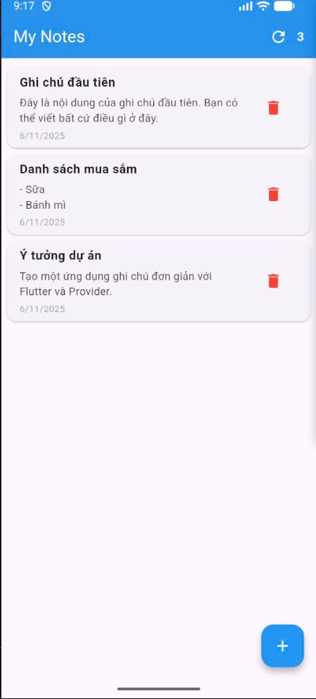
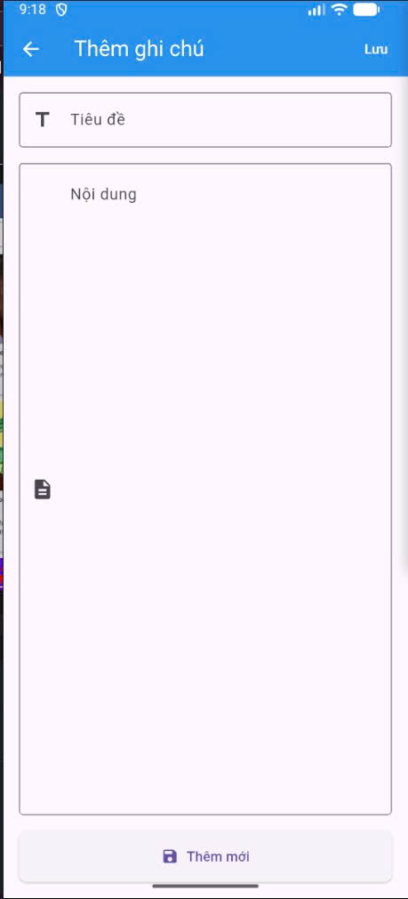

# 📝 Note App - Flutter

Một ứng dụng ghi chú đơn giản được xây dựng bằng **Flutter** với **Provider State Management**, cho phép người dùng tạo, chỉnh sửa và xóa ghi chú một cách dễ dàng.

## ✨ Chức năng chính

- **Tạo ghi chú mới** với tiêu đề và nội dung  
- **Chỉnh sửa ghi chú** hiện có  
- **Xóa ghi chú** với xác nhận  
- **Làm mới** danh sách ghi chú  

## ⚙️ Cài đặt và Chạy

### **1️⃣ Clone repository**
```bash
git clone https://github.com/bichle04/notes-app-flutter.git
cd note_app
```

### **2️⃣ Cài đặt dependencies**
```bash
flutter pub get
```

### **3️⃣ Chạy ứng dụng**

```bash
# Khởi động emulator
flutter emulators --launch <emulator_id>

# Chạy app
flutter run
```


## 🖼 Preview




---

